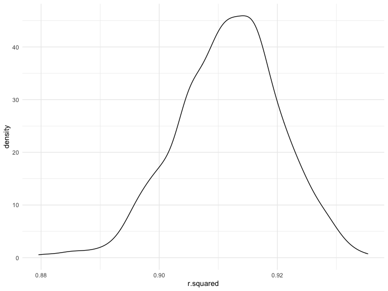

p8105_hw6_wy2369
================
Wenjing Yang
2022-11-29

# Problem 1

### Draw bootstrap samples

To obtain a distribution for $\hat{r}^2$, we’ll follow basically the
same procedure we used for regression coefficients: draw bootstrap
samples; the a model to each; extract the value I’m concerned with; and
summarize. Here, we’ll use `modelr::bootstrap` to draw the samples and
`broom::glance` to produce `r.squared` values.

``` r
weather_df = 
  rnoaa::meteo_pull_monitors(
    c("USW00094728"),
    var = c("PRCP", "TMIN", "TMAX"), 
    date_min = "2017-01-01",
    date_max = "2017-12-31") %>%
  mutate(
    name = recode(id, USW00094728 = "CentralPark_NY"),
    tmin = tmin / 10,
    tmax = tmax / 10) %>%
  select(name, id, everything())
```

    ## Registered S3 method overwritten by 'hoardr':
    ##   method           from
    ##   print.cache_info httr

    ## using cached file: ~/Library/Caches/R/noaa_ghcnd/USW00094728.dly

    ## date created (size, mb): 2022-10-11 00:57:46 (8.406)

    ## file min/max dates: 1869-01-01 / 2022-09-30

### Distribution for $\hat{r}^2$ value

``` r
weather_df %>% 
  modelr::bootstrap(n = 1000) %>% 
  mutate(
    models = map(strap, ~lm(tmax ~ tmin, data = .x) ),
    results = map(models, broom::glance)) %>% 
  select(-strap, -models) %>% 
  unnest(results) %>% 
  ggplot(aes(x = r.squared)) + geom_density()
```



In this example, the $\hat{r}^2$ value is high, and the upper bound at 1
may be a cause for the generally skewed shape of the distribution. If we
wanted to construct a confidence interval for $R^2$, we could take the
2.5% and 97.5% quantiles of the estimates across bootstrap samples.
However, because the shape isn’t symmetric, using the mean +/- 1.96
times the standard error probably wouldn’t work well.

### Distribution for $\log(\beta_0 * \beta1)$

We can produce a distribution for $\log(\beta_0 * \beta1)$ using a
similar approach, with a bit more wrangling before we make our plot.

``` r
weather_df %>% 
  modelr::bootstrap(n = 1000) %>% 
  mutate(
    models = map(strap, ~lm(tmax ~ tmin, data = .x) ),
    results = map(models, broom::tidy)) %>% 
  select(-strap, -models) %>% 
  unnest(results) %>% 
  select(id = `.id`, term, estimate) %>% 
  pivot_wider(
    names_from = term, 
    values_from = estimate) %>% 
  rename(beta0 = `(Intercept)`, beta1 = tmin) %>% 
  mutate(log_b0b1 = log(beta0 * beta1)) %>% 
  ggplot(aes(x = log_b0b1)) + geom_density()
```


As with $r^2$, this distribution is somewhat skewed and has some
outliers.

The point of this is not to say you should always use the bootstrap –
it’s possible to establish “large sample” distributions for strange
parameters / values / summaries in a lot of cases, and those are great
to have. But it is helpful to know that there’s a way to do inference
even in tough cases.

# Problem 2

### Read and clean data

Create a `city_state` variable and a `homicide_status` (binary) variable
indicating whether the homicide is solved. Number 0 means “unsolved” and
1 means “solved”

Then omit cities Dallas, TX; Phoenix, AZ; and Kansas City, MO – these
don’t report victim race. Also omit Tulsa, AL – this is a data entry
mistake. Filter whom victim_race is white or black, and convert
`victim_age` to numerical variable. Drop NAs which shown in
`victim_age`.

``` r
homicide_data = 
  read_csv("./data/homicide-data.csv") %>% 
  janitor::clean_names() %>% 
  mutate(
    city_state = str_c(city, ",", state),
    victim_age = as.numeric(victim_age),
    homicide_status =  ifelse(disposition != "Closed by arrest", 0, 1)) %>% 
  filter(city_state != "Dallas,TX" & city_state != "Phoenix,AZ" & city_state !="Kansas City,MO" & city_state != "Tulsa,AL") %>% 
  filter(victim_race == "White" | victim_race == "Black") %>% 
  drop_na(victim_age)
```

### Fit a logistic regression for one city

Use the `glm` function to fit a logistic regression with resolved vs
unresolved as the outcome and `victim_age`, `victim_sex` and
`victim_race` as predictors. Save the output of `glm` as an R object and
apply the `broom::tidy` to tidy the data.

``` r
baltimore_reg = 
  homicide_data %>% 
  filter(city_state == "Baltimore,MD") %>% 
  glm(homicide_status ~ victim_age + victim_sex + victim_race, data = ., family = binomial()) %>% 
  broom::tidy() %>% 
  mutate(
    odds_ratio = exp(estimate),
    lower_CI = exp(estimate - 1.96 * std.error),
    upper_CI = exp(estimate + 1.96 * std.error)
  ) %>% 
  filter(term == "victim_sexMale") %>% 
  select(term, estimate, odds_ratio, lower_CI, upper_CI) %>% 
  knitr::kable(digits = 3)

baltimore_reg
```

| term           | estimate | odds_ratio | lower_CI | upper_CI |
|:---------------|---------:|-----------:|---------:|---------:|
| victim_sexMale |   -0.854 |      0.426 |    0.325 |    0.558 |

From the table, I obtain the estimate is **-0.854**，adjusted odds_ratio
is **0.426** and confidence interval is **(0.325, 0.558)** for solving
homicides comparing male victims to female victims keeping all other
variables fixed.

### Fit a logistic regression for each cities

Run `glm` for each of the cities in the dataset and use `map` and
`unnest` functions to create a tidy dataframe with estimates, odds
ratios and confidence intervals for each city.

``` r
homicide_reg = 
  homicide_data %>% 
  nest(data = -city_state) %>% 
  mutate(
    results = map(.x = data ,~glm(homicide_status ~ victim_age + victim_sex + victim_race, data = .x, family = binomial())),
    results = map(results, broom::tidy)) %>% 
  unnest(results) %>%
  mutate(
    odds_ratio = exp(estimate),
    lower_CI = exp(estimate - 1.96 * std.error),
    upper_CI = exp(estimate + 1.96 * std.error)
  ) %>% 
  filter(term == "victim_sexMale") %>% 
  select(city_state, estimate, odds_ratio, lower_CI, upper_CI) 

homicide_reg %>%
  knitr::kable(digits = 3)
```

| city_state        | estimate | odds_ratio | lower_CI | upper_CI |
|:------------------|---------:|-----------:|---------:|---------:|
| Albuquerque,NM    |    0.570 |      1.767 |    0.831 |    3.761 |
| Atlanta,GA        |    0.000 |      1.000 |    0.684 |    1.463 |
| Baltimore,MD      |   -0.854 |      0.426 |    0.325 |    0.558 |
| Baton Rouge,LA    |   -0.964 |      0.381 |    0.209 |    0.695 |
| Birmingham,AL     |   -0.139 |      0.870 |    0.574 |    1.318 |
| Boston,MA         |   -0.395 |      0.674 |    0.356 |    1.276 |
| Buffalo,NY        |   -0.653 |      0.521 |    0.290 |    0.935 |
| Charlotte,NC      |   -0.123 |      0.884 |    0.557 |    1.403 |
| Chicago,IL        |   -0.891 |      0.410 |    0.336 |    0.501 |
| Cincinnati,OH     |   -0.917 |      0.400 |    0.236 |    0.677 |
| Columbus,OH       |   -0.630 |      0.532 |    0.378 |    0.750 |
| Denver,CO         |   -0.736 |      0.479 |    0.236 |    0.971 |
| Detroit,MI        |   -0.541 |      0.582 |    0.462 |    0.734 |
| Durham,NC         |   -0.208 |      0.812 |    0.392 |    1.683 |
| Fort Worth,TX     |   -0.402 |      0.669 |    0.397 |    1.127 |
| Fresno,CA         |    0.289 |      1.335 |    0.580 |    3.071 |
| Houston,TX        |   -0.341 |      0.711 |    0.558 |    0.907 |
| Indianapolis,IN   |   -0.085 |      0.919 |    0.679 |    1.242 |
| Jacksonville,FL   |   -0.329 |      0.720 |    0.537 |    0.966 |
| Las Vegas,NV      |   -0.178 |      0.837 |    0.608 |    1.154 |
| Long Beach,CA     |   -0.891 |      0.410 |    0.156 |    1.082 |
| Los Angeles,CA    |   -0.413 |      0.662 |    0.458 |    0.956 |
| Louisville,KY     |   -0.712 |      0.491 |    0.305 |    0.790 |
| Memphis,TN        |   -0.324 |      0.723 |    0.529 |    0.988 |
| Miami,FL          |   -0.663 |      0.515 |    0.304 |    0.872 |
| Milwaukee,wI      |   -0.319 |      0.727 |    0.499 |    1.060 |
| Minneapolis,MN    |   -0.054 |      0.947 |    0.478 |    1.875 |
| Nashville,TN      |    0.034 |      1.034 |    0.685 |    1.562 |
| New Orleans,LA    |   -0.536 |      0.585 |    0.422 |    0.811 |
| New York,NY       |   -1.338 |      0.262 |    0.138 |    0.499 |
| Oakland,CA        |   -0.574 |      0.563 |    0.365 |    0.868 |
| Oklahoma City,OK  |   -0.026 |      0.974 |    0.624 |    1.520 |
| Omaha,NE          |   -0.961 |      0.382 |    0.203 |    0.721 |
| Philadelphia,PA   |   -0.701 |      0.496 |    0.378 |    0.652 |
| Pittsburgh,PA     |   -0.842 |      0.431 |    0.265 |    0.700 |
| Richmond,VA       |    0.006 |      1.006 |    0.498 |    2.033 |
| San Antonio,TX    |   -0.350 |      0.705 |    0.398 |    1.249 |
| Sacramento,CA     |   -0.402 |      0.669 |    0.335 |    1.337 |
| Savannah,GA       |   -0.143 |      0.867 |    0.422 |    1.780 |
| San Bernardino,CA |   -0.692 |      0.500 |    0.171 |    1.462 |
| San Diego,CA      |   -0.884 |      0.413 |    0.200 |    0.855 |
| San Francisco,CA  |   -0.498 |      0.608 |    0.317 |    1.165 |
| St. Louis,MO      |   -0.352 |      0.703 |    0.530 |    0.932 |
| Stockton,CA       |    0.301 |      1.352 |    0.621 |    2.942 |
| Tampa,FL          |   -0.214 |      0.808 |    0.348 |    1.876 |
| Tulsa,OK          |   -0.025 |      0.976 |    0.614 |    1.552 |
| Washington,DC     |   -0.371 |      0.690 |    0.468 |    1.017 |

### Create a plot

The plot shows the estimated odds ratios and confidence intervals for
each city.

``` r
homicide_reg %>%
  ggplot(aes(x = fct_reorder(city_state,odds_ratio), y = odds_ratio)) +
  geom_point() +
  geom_errorbar(aes(ymin = lower_CI, ymax = upper_CI)) +
  theme(axis.text.x = element_text(angle = 90, hjust = 1)) +
  labs(title = "The estimated odds ratios and confidence intervals for each city",
       x = "City, State",
       y = "Estimated odds ratios") 
```


Based on this plot, New York,NY might have the lowest estimated odds
ratio for solving homicides comparing male victims to female victims,
and Albuquerque,NM might have highest estimated odds ratio comparing
male victims to female victims. There are some wide confidence intervals
shown in the plot, for example Fresno,CA, Stockton,CA and
Albuquerque,NM.

# Problem 3

### Load and clean data

Load and clean the data and check for missing data using this code
chunk.

``` r
birthweight_data = 
  read_csv("./data/birthweight.csv") %>% 
  janitor::clean_names() 
```

    ## Rows: 4342 Columns: 20
    ## ── Column specification ────────────────────────────────────────────────────────
    ## Delimiter: ","
    ## dbl (20): babysex, bhead, blength, bwt, delwt, fincome, frace, gaweeks, malf...
    ## 
    ## ℹ Use `spec()` to retrieve the full column specification for this data.
    ## ℹ Specify the column types or set `show_col_types = FALSE` to quiet this message.

``` r
skimr::skim(birthweight_data)
```

|                                                  |                  |
|:-------------------------------------------------|:-----------------|
| Name                                             | birthweight_data |
| Number of rows                                   | 4342             |
| Number of columns                                | 20               |
| \_\_\_\_\_\_\_\_\_\_\_\_\_\_\_\_\_\_\_\_\_\_\_   |                  |
| Column type frequency:                           |                  |
| numeric                                          | 20               |
| \_\_\_\_\_\_\_\_\_\_\_\_\_\_\_\_\_\_\_\_\_\_\_\_ |                  |
| Group variables                                  | None             |

Data summary

**Variable type: numeric**

| skim_variable | n_missing | complete_rate |    mean |     sd |     p0 |     p25 |     p50 |     p75 |   p100 | hist  |
|:--------------|----------:|--------------:|--------:|-------:|-------:|--------:|--------:|--------:|-------:|:------|
| babysex       |         0 |             1 |    1.49 |   0.50 |   1.00 |    1.00 |    1.00 |    2.00 |    2.0 | ▇▁▁▁▇ |
| bhead         |         0 |             1 |   33.65 |   1.62 |  21.00 |   33.00 |   34.00 |   35.00 |   41.0 | ▁▁▆▇▁ |
| blength       |         0 |             1 |   49.75 |   2.72 |  20.00 |   48.00 |   50.00 |   51.00 |   63.0 | ▁▁▁▇▁ |
| bwt           |         0 |             1 | 3114.40 | 512.15 | 595.00 | 2807.00 | 3132.50 | 3459.00 | 4791.0 | ▁▁▇▇▁ |
| delwt         |         0 |             1 |  145.57 |  22.21 |  86.00 |  131.00 |  143.00 |  157.00 |  334.0 | ▅▇▁▁▁ |
| fincome       |         0 |             1 |   44.11 |  25.98 |   0.00 |   25.00 |   35.00 |   65.00 |   96.0 | ▃▇▅▂▃ |
| frace         |         0 |             1 |    1.66 |   0.85 |   1.00 |    1.00 |    2.00 |    2.00 |    8.0 | ▇▁▁▁▁ |
| gaweeks       |         0 |             1 |   39.43 |   3.15 |  17.70 |   38.30 |   39.90 |   41.10 |   51.3 | ▁▁▂▇▁ |
| malform       |         0 |             1 |    0.00 |   0.06 |   0.00 |    0.00 |    0.00 |    0.00 |    1.0 | ▇▁▁▁▁ |
| menarche      |         0 |             1 |   12.51 |   1.48 |   0.00 |   12.00 |   12.00 |   13.00 |   19.0 | ▁▁▂▇▁ |
| mheight       |         0 |             1 |   63.49 |   2.66 |  48.00 |   62.00 |   63.00 |   65.00 |   77.0 | ▁▁▇▂▁ |
| momage        |         0 |             1 |   20.30 |   3.88 |  12.00 |   18.00 |   20.00 |   22.00 |   44.0 | ▅▇▂▁▁ |
| mrace         |         0 |             1 |    1.63 |   0.77 |   1.00 |    1.00 |    2.00 |    2.00 |    4.0 | ▇▇▁▁▁ |
| parity        |         0 |             1 |    0.00 |   0.10 |   0.00 |    0.00 |    0.00 |    0.00 |    6.0 | ▇▁▁▁▁ |
| pnumlbw       |         0 |             1 |    0.00 |   0.00 |   0.00 |    0.00 |    0.00 |    0.00 |    0.0 | ▁▁▇▁▁ |
| pnumsga       |         0 |             1 |    0.00 |   0.00 |   0.00 |    0.00 |    0.00 |    0.00 |    0.0 | ▁▁▇▁▁ |
| ppbmi         |         0 |             1 |   21.57 |   3.18 |  13.07 |   19.53 |   21.03 |   22.91 |   46.1 | ▃▇▁▁▁ |
| ppwt          |         0 |             1 |  123.49 |  20.16 |  70.00 |  110.00 |  120.00 |  134.00 |  287.0 | ▅▇▁▁▁ |
| smoken        |         0 |             1 |    4.15 |   7.41 |   0.00 |    0.00 |    0.00 |    5.00 |   60.0 | ▇▁▁▁▁ |
| wtgain        |         0 |             1 |   22.08 |  10.94 | -46.00 |   15.00 |   22.00 |   28.00 |   89.0 | ▁▁▇▁▁ |

Based on these results, there is no missing data in this dataset and 20
variables are all numeric.

### Fit a regression model

Propose a regression model for birthweight. This model may be based on a
hypothesized structure for the factors that underly birthweight, on a
data-driven model-building process, or a combination of the two.
Describe your modeling process and show a plot of model residuals
against fitted values – use add_predictions and add_residuals in making
this plot.
